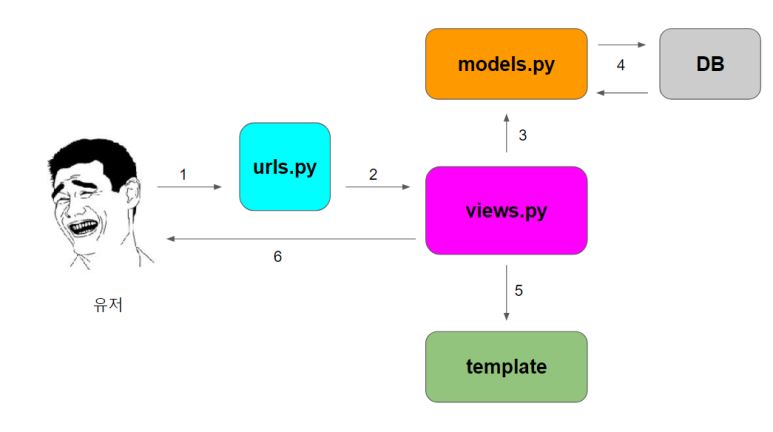

## MTV 패턴

CRUD2 세션의 내용중 MTV 패턴이란 단어가 궁금해서 알아보았다.
MTV 패턴이란 Django 프로젝트 내에서 유저의 요청부터 응답까지 동작하는 방식에 대한 패턴 중의 하나이다.

장고는 MVC(Model-View-Controller)패턴과 대응되는 MTV(Model - Template - View)을 따르며 기본적인 틀은 유사하다.
각각의 구성 요소들이 독립적으로 자신의 임무를 수행하여 Django Framework가 동작되는 것이며 각각의 역할은 다음과 같다.

### 1. Model

DB에 저장되는 데이터를 의미한다. excel과 같은 표의 형태로 정리하여 데이터베이스에 넣는다고 생각하면 이해하기 쉽다.
모델은 클래스로 정의되며 하나의 클래스가 하나의 DB Table이다.
원래 DB를 조작하기 위해선 SQL을 다룰 줄 알아야 하지만 장고는 ORM(Object Relational Mapping)기능을 지원하기 때문에 파이썬 코드로 DB를 조작할 수 있다.

> ORM (Obeject-Relational Mapping)  
> SQL 언어 대신 데이터베이스를 쉽게 연결해 주는 방법

### 2. Template

유저에게 보여지는 화면을 의미한다. 장고는 뷰에서 로직을 처리한 후 html 파일을 context와 함께 렌더링하는데 이 때의 html 파일을 템플릿이라 칭한다.
장고는 자체적인 Django Template 문법을 지원하며 이 문법 덕분에 html 파일 내에서 context로 받은 데이터를 활용할 수 있다.
장고 템플릿 시스템 문법에 맞게 python문법을 활용하여 작성하면 되므로, 다른 작업들과 화면 디자인 작업을 분리하여 확장성을 극대화 한다.
즉, 보여지는 부분을 만드는 사람은 그 부분에만 집중하여 만들 수 있게 도와주는 역할을 한다.

### 3. View

뷰는 웹 요청을 받고, 전달받은 데이터들을 해당 어플리케이션의 로직으로 가공하여, 그 결과를 템플릿에 보내준다. MTV 각각 요소가 모두 중요하지만 그 중에서도 머리역할을 하는 녀석이 View이다. 데이터를 가공하는 처리를 해야한다 싶으면 뷰를 건드리면 된다.
다만 항상 템플릿을 렌더링 하는 것은 아니고 백엔드에서 데이터만 주고 받는 경우도 있다.

### 4. URLconf

URL은 view와 template을 이어주는 역할을 하고, 요 부분을 만들어 주는 작업을 URLconf라고 한다. URL 패턴을 정의하여 해당 URL과 뷰를 매핑하는 단계라고 생각하면 된다.

## 간단정리

- 데이터저장 형태를 어떻게할지 설정하겠다. → Model
- 유저에게 보여지는 화면을 고치고 싶다. → Template
- 데이터를 처리해서 가공하고 싶다. → View
- 가공한 데이터를 유저가 보는 화면으로 넘겨주고 싶다 → URLconf

## MTV패턴 순서



1. 유저가 특정 url로 요청
2. urlConf를 통해 해당 url과 매핑된 뷰를 호출
3. 호출된 뷰는 요청에 따라 적절한 로직을 수행하며 그 과정에서 모델에게 CRUD를 지시
4. 모델은 ORM을 통해 DB와 소통하며 CRUD를 수행
5. 그 후 뷰는 지정된 템플릿을 렌더링
6. 최종 결과를 응답으로 반환

---

[참고]  
<https://tibetsandfox.tistory.com/16>  
<https://towardsdatascience.com/working-structure-of-django-mtv-architecture-a741c8c64082>

```toc

```
