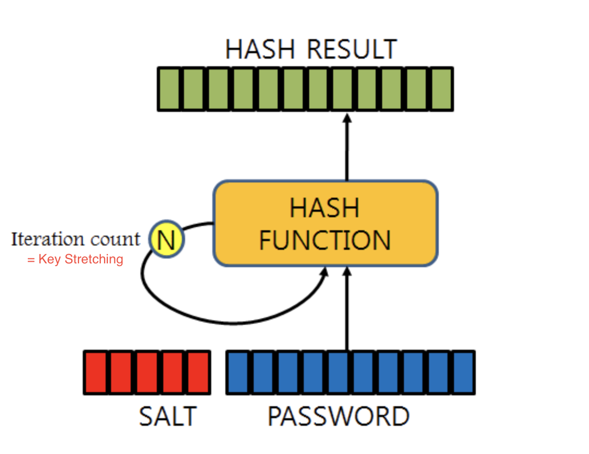
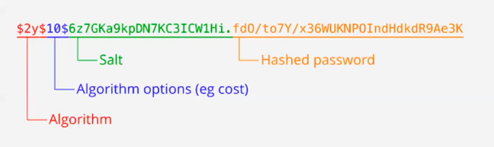

## 인증 (Authentication)

### 1. 인증이란?

- 유저의 identification를 확인하는 과정. 즉, 아이디와 비밀번호를 확인하는 절차
- 인증은 누가 우리 서비스를 쓰는지, 어떻게 쓰는지를 추적하기 위해 필요하다.
- 인증을 하기 위해서는 먼저 유저의 아이디와 비밀번호를 생성하는 기능 그리고 그 유저의 아이디와 비밀번호를 확인하는 기능이 필요하다.
- 쉽게 말하면 회원가입과 로그인으로 인증을 구현한다.

### 2. 로그인절차와 token

1. 회원가입이 된 유저의 아이디와 비밀번호를 입력
2. 서버에서는 입력한 정보가 DB에 저장된 정보와 일치하는지 확인
3. 일치시 로그인 성공과 함께 클라이언트에 access token을 전송
4. 로그인에 성공한 유저는 인증된 유저로써 이 서버의 로그인이 필요한 서비스를 이용할 시 request에 access token을 첨부해서 서버에 전송하므로 매번 로그인해도 되지 않도록 한다.

### 3. 비밀번호 관리

- 비밀번호는 보안을 위해 반드시 암호화되어 DB에 저장되어야 한다.
- 비밀번호가 암호화되지 않은 채로 DB에 저장이 되었을 경우, DB가 해킹당하면 유저의 정보가 모두 노출될 수 있고,
- 해킹의 경우가 아니더라도 내부 개발자 등에 의해 유저의 정보가 노출될 가능성이 있기 때문

### 4. 비밀번호 암호화 방법

#### 4-1. 해시함수란?

- 임의의 길이의 데이터를 고정된 길이의 데이터로 반환시켜주는 함수이다.
- 입력값의 길이가 달라도 출력값은 언제나 고정된 길이로 반환한다.
- 동일한 값이 입력되면 언제나 동일한 출력 값을 보장한다.
- 해시함수는 암호학적 해시 함수와 비 암호학적 해시함수로 구분된다.

#### 4-2. 단방향 암호화

- 암호화에는 양방향 암호화와 단방향 암호화가 있는데, 비밀번호를 암호화할 때는 주로 단방향 암호화를 사용한다.
- 단방향 암호화란, 평문을 암호문으로 바꾸는 '암호화'는 가능하지만, 암호문을 평문으로 바꾸는 '복호화'는 불가능한 암호화를 말한다.
- 단방향 암호화에는 주로 해시 함수를 이용하는데 이를 단방향 해시 함수(one-way hash function)라고 한다.
- 단방향 해시 함수는 입력값을 문자와 숫자를 임의로 나열한 일정한 길이의 다이제스트(Digest) 형태로 변환시켜준다. 여기서 다이제스트란, 해시함수를 통해 생성된 암호화된 메시지이다.
- 단방향 해시함수에는 MD5, SHA-1, SHA-256 등이 있다.

#### 4-2. 단방향 암호화의 취약점

- 무차별 대입 공격(brute-force attack)에 취약
  - 해시 함수는 원래 짧은 시간에 데이터를 검색하기 위해 설계된 것이다. 그렇게 대문에 해시 함수는 본래 처리 속도가 최대한 빠르도록 설계되었다.
  - 이런 속성 때문에 공격자는 매우 빠른 속도로 임의의 문자열의 다이제스트와 해킹할 대상의 다이제스트를 비교할 수 있다.
  - 이런 방식으로 패스워드를 추측하면 패스워드가 충분히 길거나 복잡하지 않은 경우에는 그리 긴 시간이 걸리지 않는다.
- Rainbow table attack에 취약
  - 단방향 해시 함수는 같은 값을 해싱하면 언제나 같은 다이제스트가 나온다.
  - 이 점을 이용하여 사용자들이 많이 쓰는 패스워드를 미리 해싱하여 결과값들을 모아 둔 테이블을 Rainbow table이라고 한다.

#### 4-3. 취약점을 보완하기 위한 기법

##### SALTING

- 소금을 친다는 뜻의 salting은 이름처럼 실제 비밀번호의 앞, 뒤 아무 곳에 랜덤 데이터를 더해서 해시값을 계산하는 방법을 말한다.
- 사용된 salt 값은 나중에 비밀번호 일치를 확인하기 위해 같이 저장된다.
- Rainbow table attack을 방지할 수 있는 효과가 있다.

##### Key Stretching

- 해시 암호화를 여러 번 반복하는 기법이다.
- 무차별 대입 공격을 방지하는 효과가 있다.



### 5. bcrypt를 이용한 암호화 구현

Saiting & Key Stretching 대표적인 라이브러리

- bcrypt는 Salting과 Key Stretching을 구현할 수 있는 라이브러리로 다양한 언어를 지원한다.
- bcrypt는 처음부터 비밀번호를 단방향 암호화하기 위해 만들어진 해쉬 함수이며 가장 널리 쓰인다.
- bcrypt는 hash 결과값에 salt값과 해시 값 및 반복 횟수를 같이 보관하기 때문에 비밀번호 해싱을 적용하는 데 있어 DB설계를 복잡하게 할 필요가 없어서 암호화를 구현하는데 매우 편리하다.
- bcrypt를 통해 해싱된 결과 값(Digest)의 구조는 아래와 같다.



```toc

```
